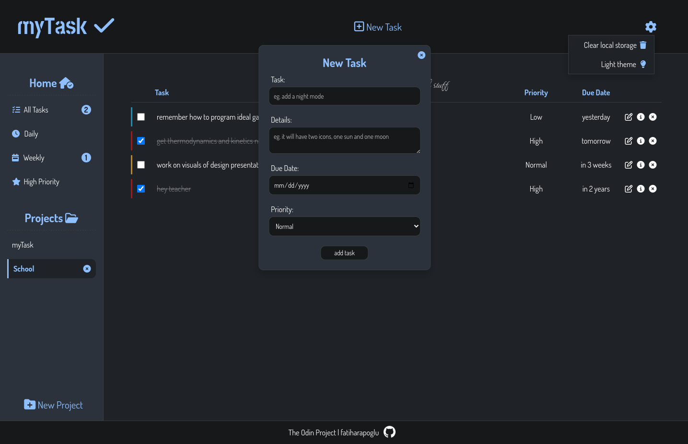

# myTask (To-Do app project)

[The Odin Project](https://www.theodinproject.com/lessons/node-path-javascript-todo-list)'s node path javascript to-do app project.

Created with HTML, CSS, JS and date-fns webpack.

[Click for live preview](https://fatiharapoglu.github.io/toDo)

